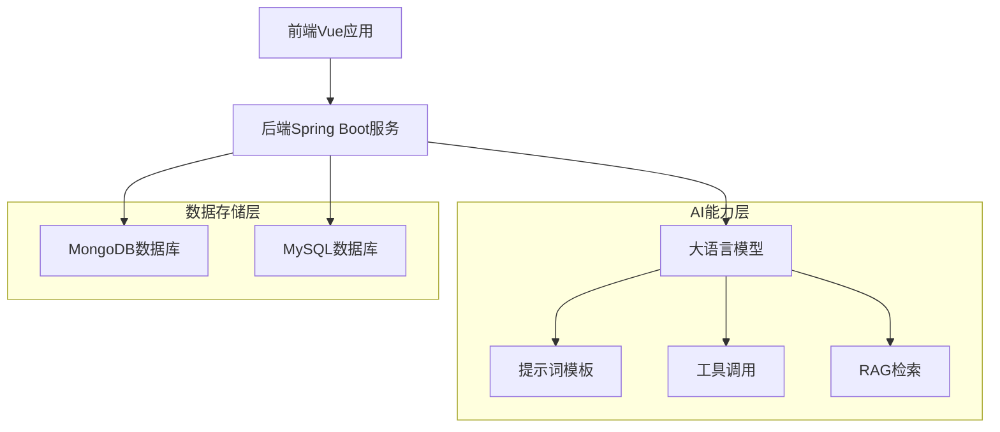

# 康康AI医疗助手

康康AI医疗助手是一个基于人工智能技术的医疗咨询系统，结合了前端Vue.js和后端Spring Boot技术栈，为用户提供智能化的医疗咨询服务。

## 技术架构

### 前端技术
- **Vue 3**: 采用Vue 3 Composition API构建用户界面
- **Vite**: 使用Vite作为构建工具，提升开发体验和构建速度
- **组件化开发**: 通过模块化的组件设计实现良好的代码复用性

### 后端技术
- **Spring Boot**: 基于Spring Boot快速搭建Java后端服务
- **LangChain4j**: 集成LangChain4j框架实现AI能力调用
- **MongoDB**: 使用MongoDB存储聊天记忆和向量数据
- **MyBatis**: 采用MyBatis进行数据库操作

## 核心功能

### 1. 智能医疗咨询
基于大语言模型提供专业的医疗问答服务，能够：
- 回答常见疾病症状和处理建议
- 提供就医指导和科室推荐
- 给出家庭护理和预防措施建议

### 2. 预约挂号管理
支持完整的在线预约挂号功能：
- 查询各科室号源信息
- 在线预约挂号服务
- 预约信息管理与取消

### 3. 多轮对话支持
- 利用MongoDB存储对话历史，实现上下文理解和记忆保持
- 支持长时间的连续对话交互

### 4. 工具调用能力
- 预约挂号工具实现完整的挂号流程处理

### 5. 知识检索增强
- 结合RAG技术检索外部知识库提供更准确的知识回答
- 向量数据库存储和检索医疗专业知识

## 项目亮点

### 1. 角色身份定制
通过提示词模板文件(`kangkang-prompt-template.txt`)为AI助手赋予特定角色身份：
- 明确的角色定位：北京协和医院官方智能客服"协和康康"
- 详细的行为规范和响应框架
- 专业、可靠、温暖的服务态度设定

### 2. 多种大模型支持
项目支持多种大模型配置，可根据需求灵活切换：
- 阿里云通义千问系列模型(qwen-turbo, qwen-plus等)
- 本地部署的Ollama模型(deepseek-r1等)
- OpenAI兼容接口的远程模型(deepseek-v3等)

### 3. 检索增强生成(RAG)
集成向量数据库和嵌入模型实现知识检索增强：
- 使用阿里云通义千问文本向量模型(text-embedding-v3)
- MongoDB向量存储支持高效相似度检索
- 提升回答准确性和专业性

### 4. 工具调用机制
通过LangChain4j框架实现AI工具调用能力：
- 预约挂号工具实现完整的挂号业务流程
- 提升AI助手的实际业务处理能力

### 5. 对话记忆存储
基于MongoDB实现持久化的对话记忆存储：
- 支持多轮对话的上下文保持
- 可配置的记忆窗口大小控制
- 分布式部署友好的存储方案

### 6. 前后端分离架构
- 清晰的职责划分，便于团队协作开发
- 独立部署，提高系统的可维护性和可扩展性
- RESTful API设计便于第三方系统集成

### 7. 可扩展的设计模式
- 采用面向接口编程，便于功能扩展
- 模块化设计，降低代码耦合度
- Spring Boot自动配置简化组件集成

## 系统架构图



## 目录结构

```
.
├── kangkang-ui/              # 前端Vue项目
│   ├── src/                  # 源码目录
│   │   ├── components/       # 组件目录
│   │   └── ...               # 其他源码文件
│   └── ...                   # 配置文件等
└── spring_boot_langchain4j/  # 后端Spring Boot项目
    ├── src/                  # 源码目录
    │   ├── main/             # 主要源码
    │   │   ├── java/         # Java源码
    │   │   └── resources/    # 资源文件
    │   └── test/             # 测试代码
    └── ...                   # 配置文件等
```

## 部署与运行

### 环境要求
- Java 17+
- Node.js 16+
- MongoDB
- MySQL 8.0+

### 前端运行
```bash
cd kangkang-ui
npm install
npm run dev
```

### 后端运行
```bash
cd spring_boot_langchain4j
# 需要配置application.yml中的相关参数
mvn spring-boot:run
```

### 配置说明
在 `application.yml` 中配置不同的大模型：

```yaml
langchain4j:
  # 阿里云远程大模型
  community:
    dashscope:
      chat-model:
        api-key: ${DASH_SCOPE_API_KEY}
        model-name: qwen-turbo
      # 向量模型
      embedding-model:
        api-key: ${DASH_SCOPE_API_KEY}
        model-name: text-embedding-v3
      # 流式输出模型
      streaming-chat-model:
        api-key: ${DASH_SCOPE_API_KEY}
        model-name: qwen-plus
  
  # 本地部署大模型
  ollama:
    chat-model:
      base-url: http://localhost:11434
      model-name: deepseek-r1:1.5b
```

## API接口

### 协和康康对话接口
- **URL**: `/kangkang/chat`
- **Method**: POST
- **Content-Type**: application/json
- **Request Body**:
  ```json
  {
    "memoryId": 123456,
    "message": "用户提问内容"
  }
  ```

## 未来规划

1. 增加更多医疗专业知识库
2. 引入语音识别和合成技术
3. 开发移动端应用
4. 集成更多AI模型以提升服务质量
5. 增强多模态交互能力